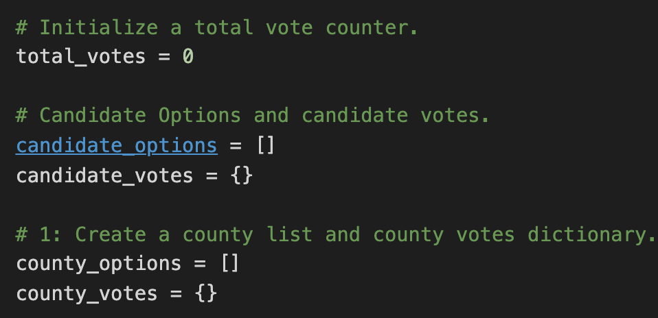

# Election_Analysis

## Project Overview
A Colorado Board of Elections employee has given you the following tasks to complete the election audit of recent local congressional election.

1. Calculate the total number of votes cast.
2. Get a complete list of candidates who received votes.
3. Calculate the toatal number of votes each candidate received.
4. Calculate the percentage of votes each candidate won.
5. Determine the winner of the election based on popular vote.

## Resources
- Data Sourse: election_results.csv
- Software: Python 3.6.1, Visual Studio Code, 1.38.1

## Summary
The analysis of the election show that:
- There were "x" votes cast in the election.
- The candidates were:
  - Candidate 1
  - Candidate 2
  - Candidate 3
- The candidate results were:
  - Candidate 1 received "x%" of te vote and "y" number of votes.
  - Candidate 2 received "x%" of te vote and "y" number of votes.
  - Candidate 3 received "x%" of te vote and "y" number of votes.
- The winner of the election was:
  - Candidate (1, 2, or 3), who received "x%" of te vote and "y" number of votes.
  
## Overview of Election Audit: 

Step 1:
- Determine a county list with the names of the counties.
- Determine a dictonary with the key and the votes cast for each county as the valuse.

Step 2:
- Determine an empty string with the county name for the county with the largest turnout.
- Determine a variable with numbers of votes of the county that had the largest turnout.

Step 3:
- Create the for loop script that finds the name from each row while reading the election results.

Step 4:
- Write an if statement that checks that the county does not match any existing county in the county list.
- Add the existing county to the list of counties.
- Begin tracking the county's vote count for the candidates.

Step 5:
- Create a script that adds a vote to the county's vote count.

Step 6:
- Write a for loop to get the county from the county dictionary.
- Write an if statement to determine the winning county and get its vote count.

Step 7:
- Print statement that prints out the county with the largest turnout.

## Election-Audit Results: 
- Total number of votes is 369,711 that were cast in this congressional election. 
- Breakdown of the number of votes and the percentage of total votes for each county in the precinct.
  - Jefferson had 10.5% which is 38,855 of votes. 
  - Denver had 82.8% which is 306,055 of votes.
  - Arapahoe had 6.7% which is 24,801 of votes.

- Denver had the largest county turnout (largest number 306,055 of votes).

- Breakdown of the number of votes and the percentage of the total votes each candidate received.
  - Charles Casper Stockham had 23.0% with 85,213 of votes.
  - Diana DeGette had 73.8% with 272,892 of votes.
  - Raymon Anthony Doane had 3.1% 11,606 of votes.

- The winner of the election is Diana DeGette. Her vote count was 272,892 (73.8%).

## Election-Audit Summary: 
The scrit can be used in different variations for other elections. 
For example, it can be used in order to determine demographics of the voters by age, nationality and ethic group and etc. You can modify and specify each characteristic.   

Another way to apply this script is to identify number of total early votes, in-person votes, mail ballots returned votes, mail ballots outstanding votes and total voted number of votes by Party Registration. It gives you a flow of voters methods during the election time.